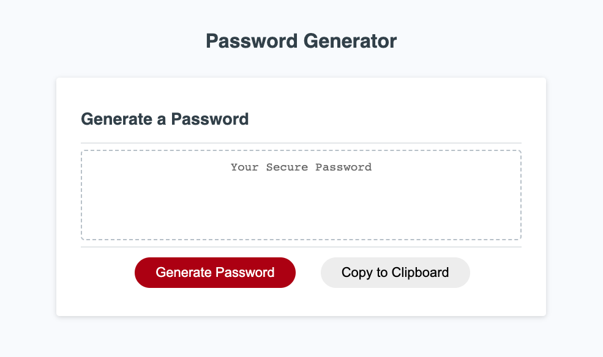

# Password Generator

## Description
This project was designed as a module 3 challenge and this application strengthens the use of Javascript to generate a random, secure password for the user.
When the users click "Generate Password" button, they can choose between 8 and 128 characters. Also, they can select any combination of lowercase, uppercase, numeric, and/or special characters step by step. When the password is generated and then the password is written to the page. I've created "Copy to Clipboard" so that the users can copy easily the password.

## Usage
Live application deployed at: https://oliviasylee.github.io/Password-Generator/

## Features
1. When the users click "Generate Password" button, they can choose between 8 and 128 characters. 
2. They can select any combination of lowercase, uppercase, numeric, and/or special characters step by step. 
3. When the password is generated and then the password is written to the page. 
4. I've created "Copy to Clipboard" so that the users can copy easily the password.

## Contributing
Olivia Seonyeong Lee
 
## Questions
If you have any questions about this projects, please contact me at oliviasylee@gmail.com. You can view more of my projects at https://github.com/oliviasylee.
